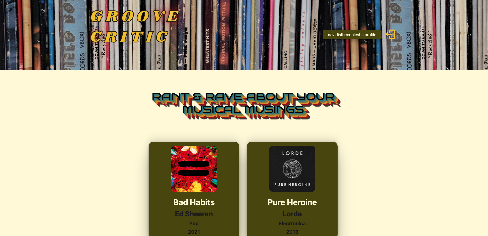
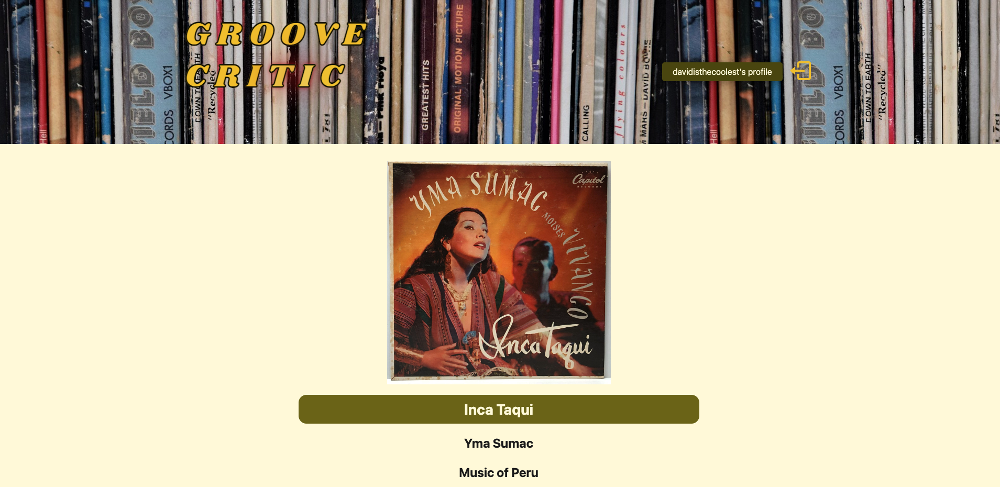
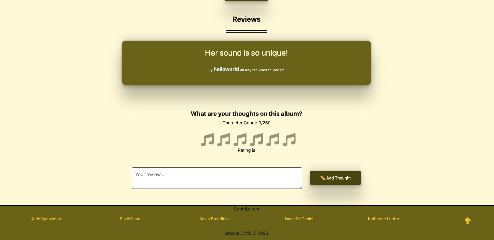

# Groove Critic

#### 🎧 *Rant & rave about your musical musings* 🎤

  ## Table of Contents
  - [Description](#description)
  - [Usage](#usage)
  - [Mock Up](#mock-up)
  - [Contributors](#contributors)
  - [License](#license)

  ## Description 
  Groove Critic is a review-aggregation application focused on music. Users have the ability to create profiles in order to rate & review their favorite musical albums. The site is designed for sound snobs by sound snobs. Jingle junkees unite! 
  
  ## Usage 
 View the deployed site [here](https://groove-critic.herokuapp.com/)

 Sign up & login to create a profile & write reviews for the album of your choice.

 ## Mock Up

View a walkthrough video [here](https://drive.google.com/file/d/1NRJJ4qtVIPckrrtJuwr11sfWBg5S2ppP/view)

  ## Contributors
* [Angela Witham](https://github.com/elawilliam) | ela.witham@gmail.com
* [Isaac McDaniel](https://github.com/NewCoderStudent39) | ilmcdaniel17@gmail.com
* [Katherine Lantto](https://github.com/kthlnt) | kathlantto@gmail.com
* [Katie Speakman](https://github.com/krchandler27) | krchandler27@gmail.com
* [Kevin Breedlove](https://github.com/Chiweenie6) | kbreedlo06@gmail.com

 ## License
  
